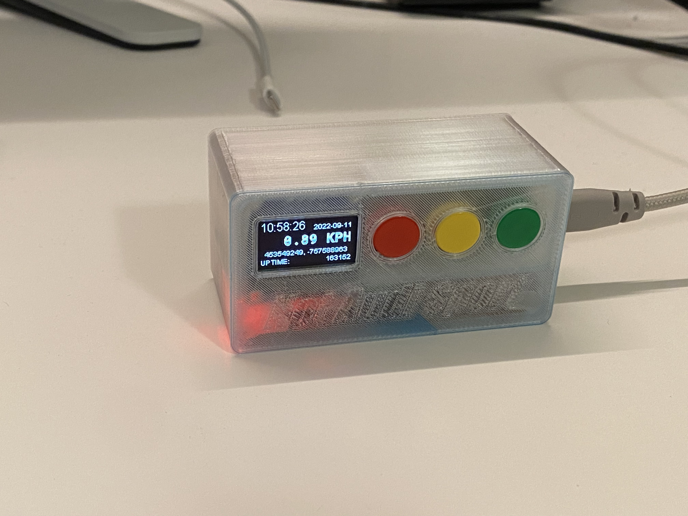
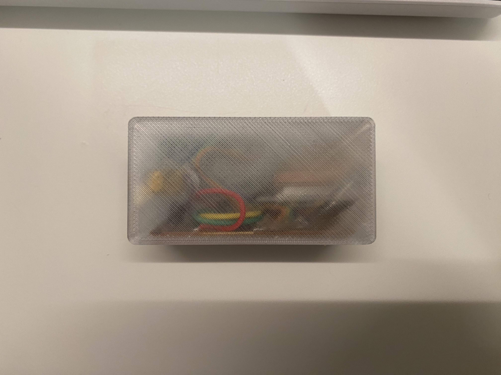
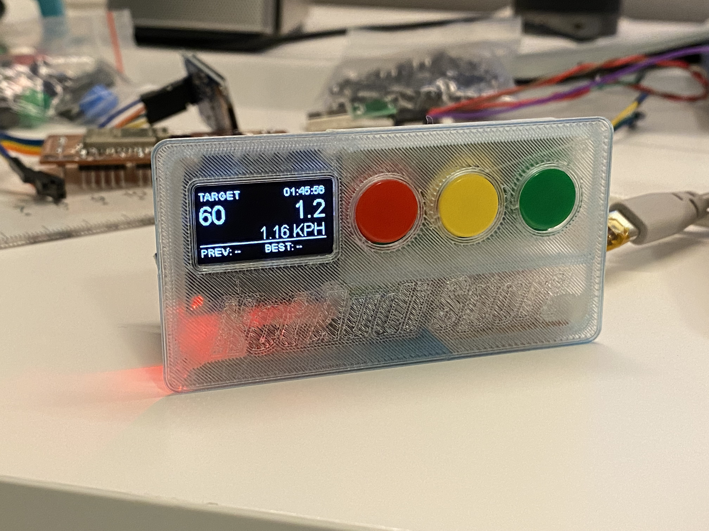
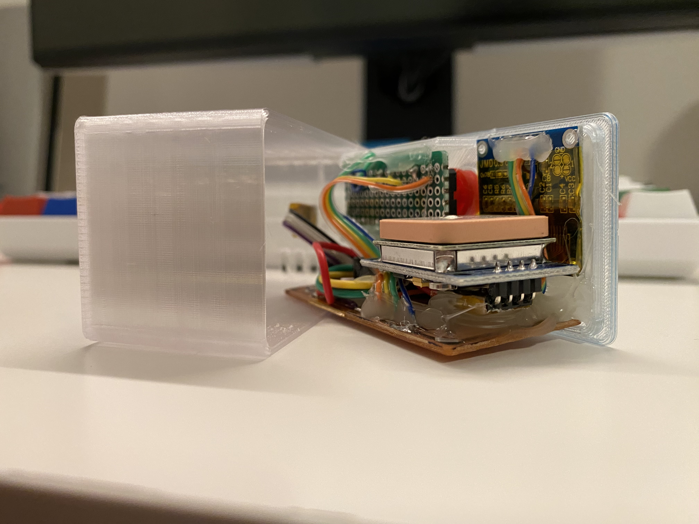

# GPS_Performance_Box
Performance box based on ublox-GPS-module and ESP32 S2

## Video

[0 - 100 KPH test](https://youtu.be/5jb0r1BLMyU)

## Pics

---
## Purpose

The purose of this project is to implement a GPS location based speedometer to test acceleration of my car. 

Similar products like [dragy](https://dragymotorsports.com) does not have a display so requires an APP and connection to a phone to work, although it provides more detail it's not very convenient to use.

This project is based on ESP32, so WiFi and Bluetooth connectivity is already onboard just require more software to make it work. And there're redundant IO ports to connect more sensors like an accelerometer, to improve or compensate the results from GPS.

## Functionality

There's 4 different screen.

- Debug screen: shows time, date, speed, location, system uptime
- 0 - 60 timer
- 0 - 80 timer
- 0 - 100 timer

Use yellow button to go to previous screen, use green button to go to next screen. In a timer screen, press red button can reset the results of the displaying timer.

Each of these 3 timers runs in background simultaneously, no need to be in a specific screen.

Automatically test acceleration, all timers are automatically triggered when speed change from 0 - 1, and will automatically stop when the target speed is reached. If target is not reached and speed falls back to 0, the timer resets and wait for speed to change from 0 - 1.

## Issues

- Currently I've noticed that the GPS speed is not reliable at low speed. It constantly jumps between 0 - 1 KPH when it's not moving at all. So instead of testing acceleration of like 0 - 100, it's actually testing 1 - 100. A future update to use accelerometer as timer trigger may mitigate this issue.

- The breakout board design was from my other project, so it wasn't optimized for the space and hardware of this project. All IO connections coulbe be routed in a better way to achieve a much compact design.

- It doesn't have a battery, requires USB power to work.

## Libraries
[SparkFun u-blox GNSS Arduino Library](https://github.com/sparkfun/SparkFun_u-blox_GNSS_Arduino_Library)

[Thingpulse ESP32 OLED driver for SSD1306](https://github.com/ThingPulse/esp8266-oled-ssd1306)

